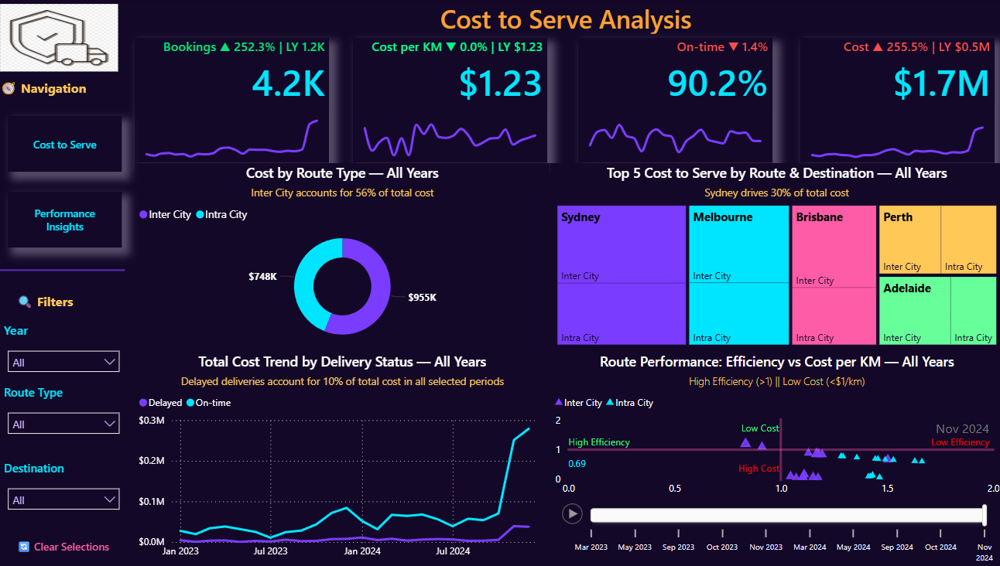
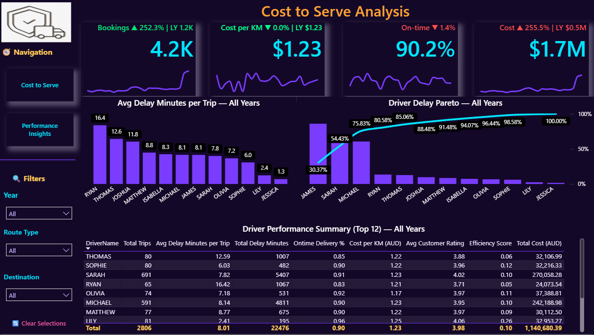

<!-- Tech Stack Banner -->

  

<h1 align="center">📦 Cost-to-Serve Logistics Dashboard</h1>

Analyzing operational efficiency, cost drivers, and delivery performance for Australian transportation networks.

---

## 🚀 **Project Overview**

This project delivers a full **Cost-to-Serve (CTS) analytics dashboard** built in **Power BI**, using real operational booking data (2023–2024).  
The goal is to help businesses understand:

- Where their logistics spending actually goes  
- Which routes, regions, and drivers create the highest cost impact  
- How delivery performance affects total operational cost  
- What inefficiencies exist and how they can be corrected  

This dashboard is designed for **logistics managers**, **transport coordinators**, and **operations teams** who require a clear, data-driven view of route profitability and delivery efficiency.

---

## 🎯 **Business Problem**

Modern logistics operations face pressure from rising fuel prices, labour constraints, seasonal demand spikes, and urban congestion.  
The organisation needed answers to three key questions:

### **1️⃣ Rising Costs**
- Total operational cost reached **$1.7M** across the two-year period.  
- Driven primarily by **fuel**, **labour**, and **maintenance**.
- End-of-year spikes indicate **capacity strain, breakdowns, and surge logistics**.

### **2️⃣ Performance Issues**
- Average on-time delivery sits at **~90%**, but certain routes show **very high delay minutes**.  
- Delay-driven inefficiencies increase hidden costs and reduce customer satisfaction.

### **3️⃣ Route & Driver Inefficiencies**
- Lack of visibility over **which cities, routes, or drivers** cause the most cost leakage.  
- Inter-City trips create 56% of all costs, but are vital for long-haul freight.  
- Delivery efficiency fluctuates significantly, showing optimisation potential.

---

## 📊 **Dashboard Preview**

### **Cost-to-Serve Overview** 

---

### **Performance Insights Page**

---

## 🛠️ **Tech Stack**

| Tool / Technology | Purpose |
|-------------------|---------|
| **Power BI** | Dashboard development, DAX modelling, visual analytics |
| **Python (optional)** | Data preprocessing, cleaning, or exploratory analysis |
| **Excel / CSV** | Data extraction & manipulation |
| **GitHub** | Version control & portfolio showcasing |

---

## 🔍 **Key Insights**

### **📌 1. Inter-City Dominance**
Inter-City routes consistently account for **~56% of total costs**, driven by long distances and higher fuel demands.

### **📌 2. Top 3 Cost Destinations = 70% of Total Cost**
- Sydney (26–30%)
- Melbourne  
- Brisbane  

These cities should be prioritised for cost optimisation and routing review.

### **📌 3. Cost Surge in Q4 (Both Years)**
Across both 2023 & 2024, **total cost spikes sharply between October–December**, due to:

- Fleet breakdowns  
- Labour shortages / holiday leave  
- Heavy peak-season freight  
- Last-minute bookings & reroutes  

### **📌 4. Efficiency Concerns**
Average efficiency score across all routes:

- **2023:** 0.71  
- **2024:** 0.66  
- Baseline target: **> 1.0**  
- Industry cost efficiency threshold: **<$1.20/km**

### **📌 5. Driver Performance**
- A small group of drivers contribute **~80% of all delay minutes** (Pareto effect).
- However — high delay minutes don’t always mean poor performance:
  - e.g., **James** has high total delay minutes but also the **highest number of trips**, meaning his per-trip delay is still reasonable.

---

## 🧩 **Dashboard Features**

### ✔ KPI Cards
- Bookings  
- Cost per km  
- On-time percentage  
- Total cost  

### ✔ Cost by Route Type (Inter-City vs Intra-City)
Shows cost distribution and long-haul impact.

### ✔ Destination Cost Heatmap
Visualises top-contributing cities.

### ✔ Delivery Status Trend
Reveals seasonal spikes and operational bottlenecks.

### ✔ Efficiency vs Cost per KM Scatter
Identifies routes that are:
- High-efficiency  
- Low-efficiency  
- High-cost  
- Low-cost  

### ✔ Driver Performance Summary
Includes:
- Avg delay minutes per trip  
- On-time delivery rate  
- Cost per km  
- Efficiency score  

---

## 📁 **Repository Structure**

